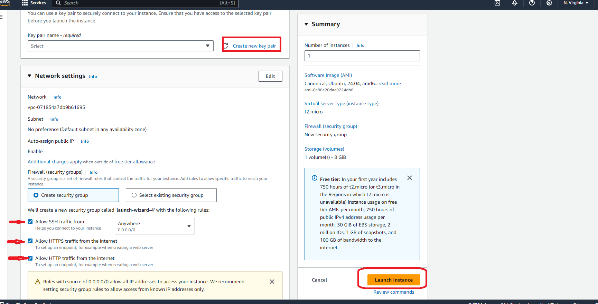
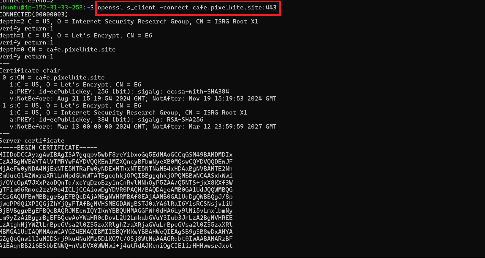
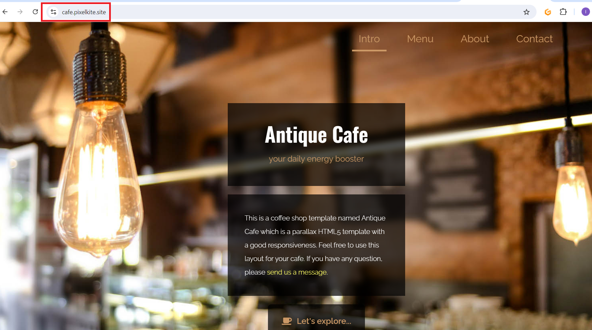

# Setup Multiple Static Websites on a Single Server Using Nginx Virtual Hosts

## I will be hosting multiple websites on a single server using Nginx Virtual Host configuration

- I created an Ubuntu server by going to EC2 and clicking on "Launch Instance" on my AWS MGT console, named the instance and selected Ubuntu

- I then created a key pair name, enabled SSH, HTTP, and HTTPS access, then proceed to click on Launch instance as shown below:

- I then clicked on the named instance clicked on connect

- I copied the command under SSH client as shown below:

- I logged on to my ubuntu server and run the command in the screenshot below:

- I also run the following commands

**THE END**

